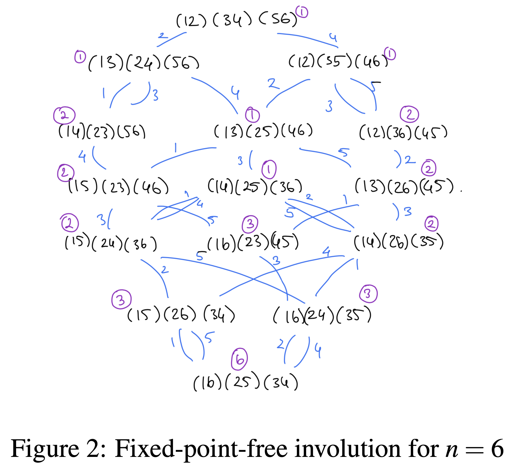

## Parameterizing chains in generalized fixed point free involutions

[](https://library.search.tulane.edu/discovery/delivery/01TUL_INST:Tulane/12433822100006326)
[](https://github.com/batu-el/parameterizing-chains-in-generalized-involutions/blob/main/HT2-Presentation.pdf)

## Abstract
The W-sets of elements of weak order posets are useful in the study of the cohomology of the closures of spherical subgroups in generalized flag varieties (Can et al., 2016). This motivated the study of the  W-sets of involutions, fixed-point-free involutions, and charged involutions in previous research (Can et al., 2016; Can and Joyce, 2013; Can et al., 2018). Generalized involutions, or mu-involutions, have similar geometric interpretations; however, parametrization of their W-sets remained an open question. Our main result presents a theorem that parametrizes the W-set of generalized fixed-point-free involutions.

The achievements of this thesis are threefold. Firstly, we provide a new proof for the parametrization of the W-sets of fixed-point-free involutions by Can et al. (2016). The proof from Can et al. (2016) is formulated as a corollary of the rule for the W-sets of all involutions, whereas our proof is self-contained. Secondly, using computational experiments, we generate the W-sets for generalized fixed-point-free involutions for n ≤ 16. Then, based on the W-sets that we generated, we propose a conjecture for parametrizing W-sets of generalized fixed-point-free involutions. Thirdly, building on the arguments we used to prove the rule for fixed-point-free involutions, we prove a complete characterization of the W-set for the generalized fixed-point-free involutions. 

## FPF Involutions


## Generalized FPF Involutions


## Citation
```bibtex
@article{elparameterizingchains2022,
    title={Parameterizing chains in generalized fixed point free involutions},
    author={El, Batu},
    journal={preprint},
    year={2022}
}